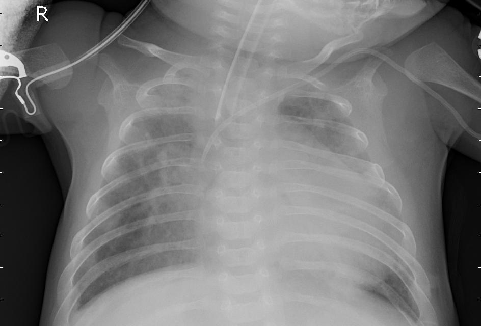

# X-PneumoNet

[Портфолио](https://jellywilliam.github.io)

[Ссылка на репозиторий](https://github.com/JellyWilliam/X-PneumoNet)

# Набор данных

[Chest X-Ray Images (Pneumonia)](https://www.kaggle.com/datasets/paultimothymooney/chest-xray-pneumonia)
представляет собой набор изображений рентгенов легких с метками классов

Пример данных:

**normal**


**bacteria**


**virus**



# Архитектура

Реализована функция получения сконфигурированной модели для обучения (CNN, ViT, BlockCNN, Hybrid CNN + ViT) и предобработчика изображений по умолчанию

```python
def get_image_model(name: str,
                    pretrained: bool = True,
                    freeze_weight: bool = False,
                    num_classes: int = 3
                    ):
    """
    Функция получения сконфигурированного классификатора изображений
    """
    valid_model_name(name)

    models_package = models.__dict__

    last_layer_name = last_layer_replace_dict[name]
    import_name = get_models_dict[name]
    weight_name = get_weights_dict[f"{import_name}_weights"]

    if "E2E" in name:
        weights = models_package[weight_name].IMAGENET1K_SWAG_E2E_V1
    else:
        weights = models_package[weight_name].DEFAULT

    model = models_package[import_name](weights=weights if pretrained else None)

    if freeze_weight:
        for param in model.parameters():
            param.requiresGrad = False

    if "." not in last_layer_name:
        in_features = model._modules[last_layer_name].in_features
        model._modules[last_layer_name] = nn.Linear(in_features=in_features, out_features=8)

    else:
        last_layer_arr = last_layer_name.split(".")

        try:
            last_layer_arr[1] = int(last_layer_arr[1])
        except ValueError:
            last_layer_arr[1] = 0

        in_features = model._modules[last_layer_arr[0]][last_layer_arr[1]].in_features
        model._modules[last_layer_arr[0]][last_layer_arr[1]] = nn.Linear(in_features=in_features,
                                                                         out_features=num_classes)

    return model, weights.transforms()
```

## Обучение

В ноутбуке [Обучение модели.ipynb](Обучение%20модели.ipynb) реализованы все этапы обучения модели.

Для упрощения конфигурации модели в данном ноутбуке имеется ячейка, представленная ниже 

```python
# Устройство, на котором будут происходить все вычисления
device = "cuda" if torch.cuda.is_available() else "cpu"

# Путь до датасета с npz архивами
dataset_path = "D:/ProjectsData/Chest X-Ray Images (Pneumonia)/chest_xray/chest_xray"

# Имя базовой модели для классификатора изображений
image_model_type = "convnext"
# Количество предсказываемых классов
num_classes = len(inference_dict)
# Загрузка весов классификатора изображений
pretrained = True
# Заморозка весов классификатора изображений
freeze_weight = False

# Количество обучающих эпох
num_epochs = 10
# Размер батча при обучении
batch_size = 3

# Пути сохранения и загрузки чекпоинта
save_path = "./models/convnext.pt"
checkpoint_path = None
```

## Графики и метрики обучения ConvNeXt

Модель обучалась 10 эпох. Ниже представлены графики изменения потерь и точности в процессе обучения 


Ниже представлены метрики тестовых данных


**Итог:** ConvNeXt за 10 эпох достиг 96% точность в определении здоровых лёгких, а также 77% в различии бактериальной и вирусной
пневмонии

## Веса модели

| Модель       | Веса                                                                                         |
|--------------|----------------------------------------------------------------------------------------------|
| mobilenet v3 | [ссылка](https://drive.google.com/file/d/1DqWQrytyKZs17D3K6Bf2JD_77CBMEQ6L/view?usp=sharing) |
| ConvNeXt L   | [ссылка](https://drive.google.com/file/d/1aYgPcH0xoivfDVu1Ofq9LcbIBj3q8U-a/view?usp=sharing) |
